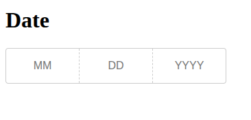

# DevxDate

This project was generated with [Angular CLI](https://github.com/angular/angular-cli) version 18.2.20.

## Install Project

Run `npm install` to install the project component. 

## Build devx-date

Run `npm run ng build devx-date` to build the project component. The build artifacts will be stored in the `dist/devx-date` directory.

# Build test-app

Run `npm run ng build test-app` to build the a test project to check the devx-date component. The build artifacts will be stored in the `dist/test-app` directory.

## Running test-app with the component

Run `npm start test-app` to execute the unit tests via [Karma](https://karma-runner.github.io).

