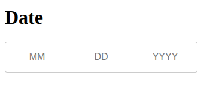

# DevxDate



This project was generated with [Angular CLI](https://github.com/angular/angular-cli) version 18.2.20.

## Install Project

Run `npm install https://lopezpagan@bitbucket.org/sociants-dev/devx-date.git` to install the project component. [This is a private repo]

## How to use
Once you publish your library, you can import it into your Angular app.

```typescript

import { DevxDateModule } from 'devx-date';

@NgModule({
  declarations: [
    AppComponent
  ],
  imports: [
    BrowserModule,
    DevxDateModule
  ],
  providers: [],
  bootstrap: [AppComponent]
})
export class AppModule { }
``` 

Then you can use the component in your html:
```html
    <devx-date [current_date]="current_date" (setDate)="setDate($event)"></devx-date>
    <p>{{ current_date ? current_date : 'Date output here' }}</p>
```

```typescript

    current_date: Date = new Date();

    setDate(current_date: Date) {
        console.log('current_date', current_date)
    }

```
